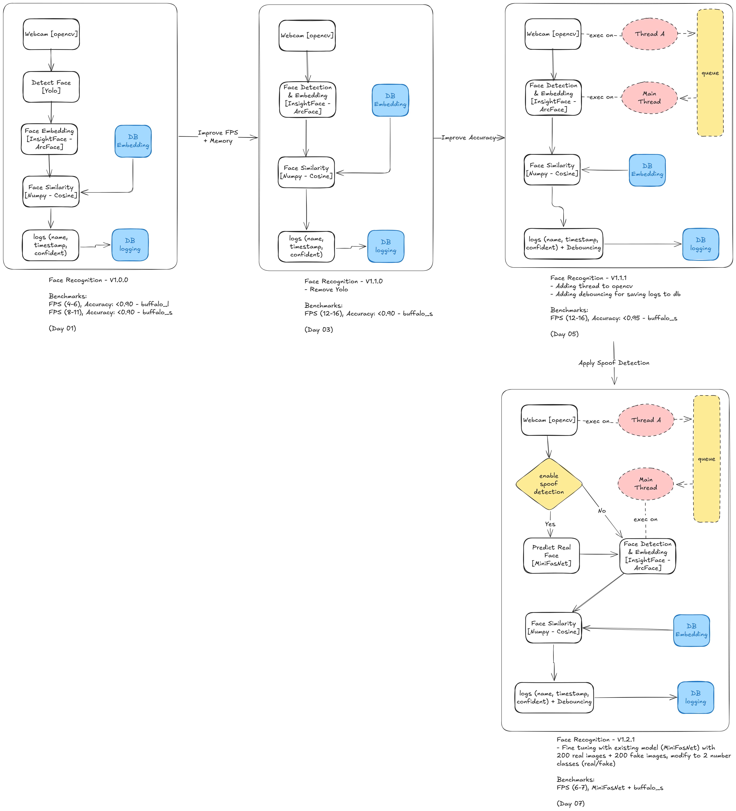

# 🧠 Real-Time Face Recognition & Anti-Spoofing System

> Version: **v1.2.1**  
> FPS: ~12–16 on CPU (`buffalo_s`)  
> Accuracy: 95%+ (w/ anti-spoof model)

---

## 📌 Overview

This is a real-time face recognition system with **optional anti-spoofing**, built using:

- 🤖 **InsightFace** for face detection & embedding (SCRFD + ArcFace)
- 🎭 **MiniFASNet** for spoof detection
- ⚡ Cosine similarity for face matching
- 📦 SQLite for local embedding + match logging
- 🧵 Threaded webcam capture for smooth frame processing
- 🔁 Debouncing to prevent noisy log entries
- 🧑‍💻 Command-line interface for easy control

---

## ✅ Key Features

- 🧠 Unified face detection + embedding (SCRFD + ArcFace)
- 🎭 Real-time spoof detection via MiniFASNet
- 💾 SQLite logging (`name`, `confidence`, `timestamp`)
- ⏱️ FPS counter, Timer profiler, Logger debouncer
- 🔄 Thread-safe video capture
- 🚀 Train spoof detection model with your own dataset
- 🧩 Modular CLI system (register, capture, test)

---

## 🔄 Version Timeline

| Version  | Improvements                                                 |
|----------|--------------------------------------------------------------|
| v1.0.0   | Basic YOLOv8 → ArcFace pipeline + SQLite logging             |
| v1.1.0   | Unified InsightFace pipeline (SCRFD + ArcFace)               |
| v1.1.1   | Threaded webcam + debouncing + faster DB logging             |
| v1.2.1   | Anti-spoofing (MiniFASNet), CLI mode switch, self-training   |

---

## 🎮 CLI Usage

```bash
python main.py
```

You'll see an interactive menu:

### Mode selection:
```
1. Face Recognition Only
2. Face Recognition + Anti-Spoofing
3. Exit
```

Each mode provides options:

#### 🟦 Recognition Mode:
```
1. Register face
2. Test
3. Go back
```

#### 🟥 Spoofing Mode:
```
1. Register face
2. Capture real/fake and train
3. Test
4. Go back
```

---

## 🧪 Training Your Own Spoof Detection Model

```bash
# In CLI → Spoofing Mode → "Capture real/fake and train"
```

What it does:
1. Opens webcam
2. You press:
   - `r` → save real image
   - `f` → save fake image
3. After capture, it trains MiniFASNet on the dataset

Output: `models/anti_spoofing/minifasnet_custom_data.pth`

---

### 🎥 Demo: Real-time Face Recognition with Anti-Spoofing
[](https://youtu.be/VwyVgw2Gph4)


## 🗂 Folder Structure

```bash
face-recognition/
│
├── config/              # App settings
├── core/                # FPSCounter, Timer, webcam manager
├── db/                  # SQLite, face embedding + log DB
├── modules/             # FaceDetector, Embedder, Matcher, Spoof model
├── trainers/            # Fine-tuning logic (MiniFASNet)
├── utils/               # Drawing, debouncer, etc.
│
├── main.py              # Entry point (CLI menu)
├── run_recognition.py   # Handles recognition mode
├── run_spoofing.py      # Handles spoofing mode
├── face_registration.py # Register face with name
├── collect_dataset.py   # CLI tool to collect real/fake spoof data
├── requirements.txt
├── requirements_local.txt
├── Dockerfile
├── docker-compose.yml
└── README.md
```

---

## 📊 Performance Benchmarks

| Mode              | FPS     | Accuracy     | Notes                       |
|-------------------|---------|--------------|-----------------------------|
| Face Recognition  | ~12–16  | ≥ 95%        | ArcFace (buffalo_s)         |
| With Spoofing     | ~6–7    | ~95% (2-class) | MiniFASNet (custom trained) |

> Tested on **CPU only (AMD Ryzen AI 7)**  
> ~200 real + 200 fake images (per your dataset)

---

## 📸 Architecture



---

## ⚙️ Dev Setup

```bash
# Install base deps
pip install -r requirements.txt

# Optional: for dev tools
pip install -r requirements_local.txt
```

---


## 📝 License

MIT © 2025 Sokritha Yen

---

## 🙌 Credits

- [InsightFace](https://github.com/deepinsight/insightface)
- [MiniFASNet (Silent-Face-Anti-Spoofing)](https://github.com/ZitongYu/Face-Anti-Spoofing)